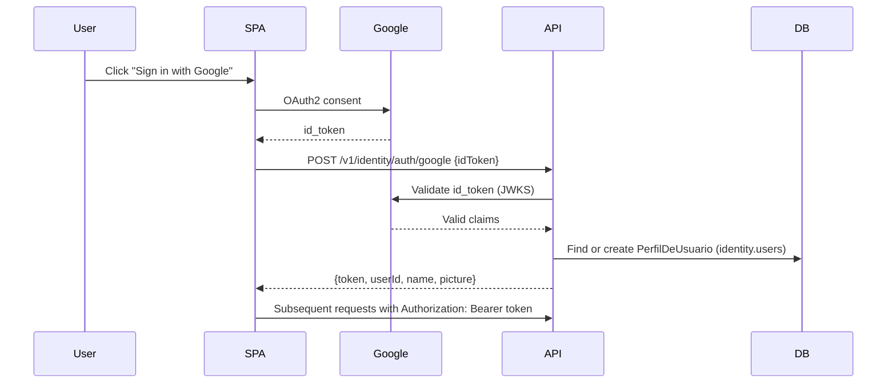
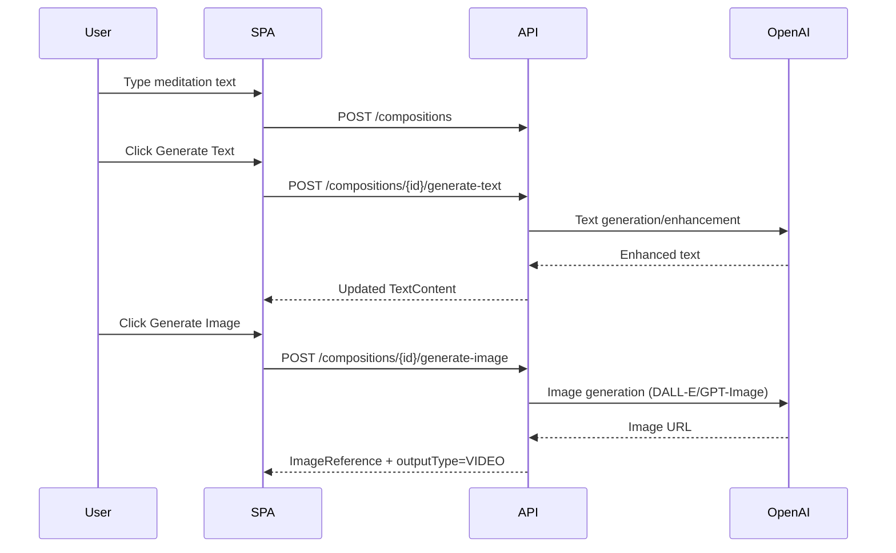
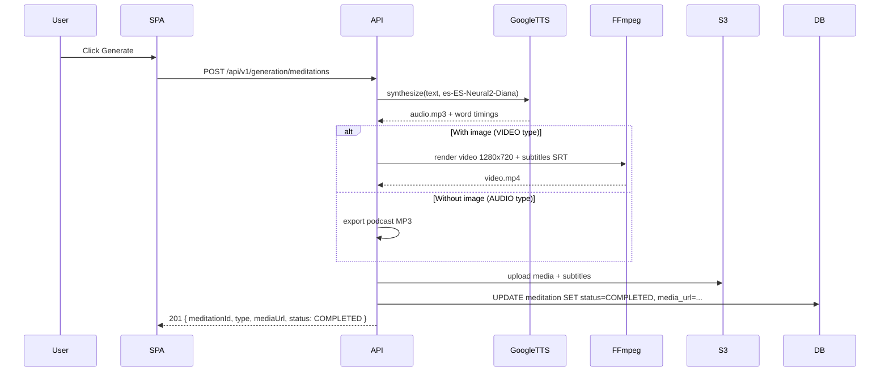
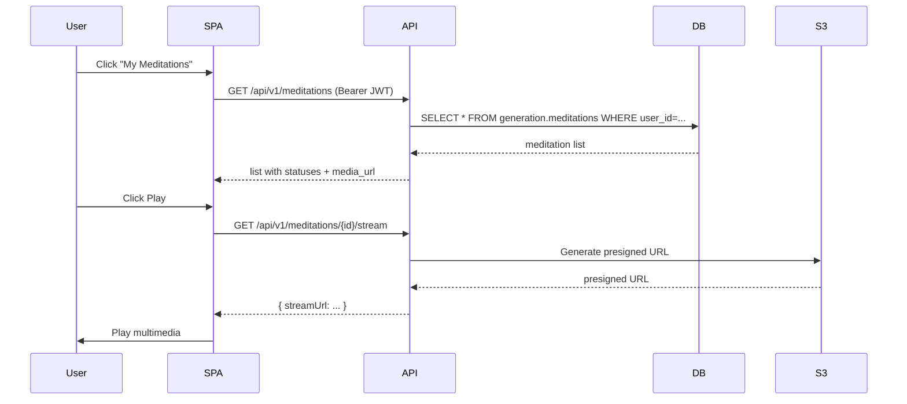

# 🧪 **Meditation Builder — MVP Design Document**

## 1️⃣ Software Overview

**Short Description:**

Meditation Builder is a web SPA that allows any authenticated user to create personalized meditations: write (or AI-generate) a meditation text, optionally select background music and an image, and the system automatically produces an MP4 video (with synchronized subtitles) or an MP3 podcast with a real narrated voice. Generated meditations are saved and can be played back at any time.

**Unique Value Proposition:**

- Full E2E pipeline: from plain text to professional video/podcast in a single screen
- Real-voice narration (Google TTS) + SRT subtitles auto-synchronized
- One-click AI text and image generation (OpenAI)
- Hexagonal architecture with 4 Bounded Contexts: `identity`, `meditationbuilder`, `meditation.generation`, `playback`

**Main Features (MVP):**

1. **US1 — Google OAuth Authentication**: Gmail account login, backend-issued JWT, automatic user profile
2. **US2 — Composition**: editor with AI text/image generation, music selection, preview, output-type indicator (video/podcast)
3. **US3 — Generation**: real Google TTS voice + synchronized SRT subtitles + FFmpeg render + S3 storage
4. **US4 — Library & Playback**: list of user meditations with status, playback of completed ones

---

## 2️⃣ Lean Canvas (textual)

| Field | Content |
| --- | --- |
| Problem | Users need personalized meditation content; manual creation is slow and inconsistent |
| Customer Segments | Individuals interested in wellness and meditation apps |
| Unique Value Proposition | Fast, AI-driven, end-to-end meditation content generation |
| Solution | SPA (React) + API (Spring Boot Java 21, hexagonal) + Google TTS + FFmpeg + S3 + PostgreSQL |
| Channels | Web SPA, app integration, social sharing |
| Revenue Streams | Subscription, pay-per-video, premium content |
| Cost Structure | AI API calls, compute, storage, queue, infra |
| Key Metrics | Meditation generation time, completion rate, user engagement |
| Unfair Advantage | Fully automated multimedia pipeline with traceability |

---

## 3️⃣ Use Cases

### **US1 — Google OAuth Authentication**

- **Goal:** The user accesses Meditation Builder using their Gmail account. The system creates their profile automatically on first access and issues its own JWT to protect all endpoints.
- **Actors:** Visitor, SPA, Backend (BC: identity), Google OIDC
- **Flow:**
    1. The visitor clicks "Sign in with Google"
    2. Google shows its OAuth2 authorization screen
    3. SPA receives a Google `id_token`
    4. SPA calls `POST /api/v1/identity/auth/google` with the `id_token`
    5. Backend validates the `id_token` against Google's public JWKS
    6. Backend finds or creates `PerfilDeUsuario` in `identity.users`
    7. Backend issues its own session JWT and returns it to the SPA
    8. SPA stores the JWT and sends it as `Authorization: Bearer` on all protected requests

- **BDD Scenarios:**

```gherkin
Feature: Access to Meditation Builder via Google account

  Scenario: New user logs in for the first time with Gmail
    Given a visitor who has never accessed the application
    When they click Sign in with Google
    And select their Gmail account and grant access
    Then they see the main application screen with their name and profile picture
    And their meditation library appears empty

  Scenario: Returning user logs in again
    Given a user who has previously signed in
    When they click Sign in with Google again
    And select the same Gmail account
    Then the application welcomes them and shows their library directly

  Scenario: Accessing a protected section without being authenticated
    Given a visitor who has not signed in
    When they try to access the library or create a new meditation
    Then the application redirects them to the login screen

  Scenario: User logs out
    Given a user with an active session
    When they click Log out
    Then the application disconnects them and redirects to the login screen

  Scenario: User cancels the Google authorization screen
    Given a visitor on the login screen
    When they click Sign in with Google but cancel the authorization
    Then they return to the login screen without any blocking error message
```

**API Spec (BC: identity):**

- `POST /api/v1/identity/auth/google`
  - Request: `{ "idToken": "<google_id_token>" }`
  - Response 200: `{ "token": "<jwt_sesion>", "userId": "uuid", "name": "...", "email": "...", "picture": "..." }`
  - Response 401: `{ "error": "Invalid Google token" }`
- `POST /api/v1/identity/auth/logout`
  - Headers: `Authorization: Bearer <token>` → Response 204



---

### **US2 — Compose Meditation Content (Meditation Builder)**

- **Goal:** The user defines their meditation content: mandatory text, optional music, and optional image. They can write manually or generate/enhance content with AI. The output type (video/podcast) is determined dynamically by whether an image is present.
- **Actors:** Authenticated user, SPA (BC: meditationbuilder), OpenAI API
- **Flow:**
    1. The user opens the Meditation Builder
    2. Writes the text (or clicks "Generate text" so the AI creates/enhances it)
    3. Optionally selects music from the catalog (with audio preview)
    4. Optionally generates an image with AI (DALL-E / GPT-Image) and previews it
    5. The indicator shows "podcast" (no image) or "video" (with image)
    6. The user clicks "Generate" to launch generation (US3)

- **BDD Scenarios:**

```gherkin
Feature: Meditation content composition

  Scenario: Mandatory text field is visible
    Given the user is authenticated
    When they open the Meditation Builder
    Then they see a mandatory text field for defining the meditation content

  Scenario: Generate meditation text from scratch (empty field)
    Given the text field is empty
    When they request the system to generate the meditation text
    Then the field is filled with a complete AI-generated meditation text

  Scenario: Generate text from existing content
    Given the text field contains content
    When they request the system to generate text
    Then the system proposes new text taking the existing content into account

  Scenario: Generate image with AI
    Given no image is selected
    When they click Generate AI image
    Then the image field displays an AI-generated image

  Scenario: Podcast output type indicator (no image)
    Given there is text but no image
    When they review the composition
    Then the system indicates the output will be a podcast (audio only)

  Scenario: Video output type indicator (with image)
    Given there is text and a selected or generated image
    When they review the composition
    Then the system indicates the output will be a video

  Scenario: Preview selected music
    Given music is selected
    When they request to preview the music
    Then the system plays an audio preview

  Scenario: Preview selected or generated image
    Given an image is selected or generated
    When they request to preview the image
    Then the system displays the image on screen
```

**API Spec (BC: meditationbuilder):**

- `POST /api/v1/meditation-builder/compositions` — create composition
- `PUT /api/v1/meditation-builder/compositions/{id}/text` — update text
- `POST /api/v1/meditation-builder/compositions/{id}/generate-text` — generate/enhance text with AI
- `POST /api/v1/meditation-builder/compositions/{id}/select-music` — select music
- `POST /api/v1/meditation-builder/compositions/{id}/generate-image` — generate image with AI



---

### **US3 — Generate Meditation (Synchronous)**

- **Goal:** Convert the user's composition into a final multimedia file (MP4 video 1280×720 or MP3 podcast). Processing is **synchronous** within a single request; there are no async queues.
- **Actors:** Authenticated user, SPA (BC: meditation.generation), Google Cloud TTS, FFmpeg, S3/LocalStack
- **Flow:**
    1. The user clicks "Generate" after completing their composition
    2. The SPA calls `POST /api/v1/generation/meditations`
    3. The backend generates voice narration with Google Cloud TTS (`es-ES-Neural2-Diana`)
    4. If an image is present → FFmpeg renders a background video with synchronized SRT subtitles
    5. If no image → the audio is exported only as a podcast MP3
    6. The resulting media is uploaded to S3 (`generation/{userId}/{meditationId}/`)
    7. The meditation is set to `COMPLETED` and the URL is returned to the frontend
- **BDD Scenarios:**

```gherkin
Feature: Multimedia meditation generation

  Scenario: Successful video generation with image
    Given the user has a composition with text and image
    When they request to generate the meditation
    Then the system generates the voice narration
    And renders an MP4 video 1280x720 with synchronized SRT subtitles
    And uploads the video to S3
    And the meditation is set to COMPLETED with its media_url

  Scenario: Successful podcast generation without image
    Given the user has a composition with text but no image
    When they request to generate the meditation
    Then the system generates the voice narration
    And exports the audio as a podcast MP3
    And uploads the podcast to S3
    And the meditation is set to COMPLETED with its media_url

  Scenario: Generation timeout
    Given the generation takes longer than 187 seconds
    When the wait time expires
    Then the meditation is set to TIMEOUT state
    And an appropriate error is returned to the user
```

**API Spec (BC: meditation.generation):**

- `POST /api/v1/generation/meditations` — trigger synchronous generation

```json
Request:  { "compositionId": "uuid", "userId": "uuid" }
Response 201: {
  "meditationId": "uuid",
  "type": "VIDEO | AUDIO",
  "mediaUrl": "https://s3.../generation/{userId}/{meditationId}/video.mp4",
  "subtitleUrl": "https://s3.../generation/{userId}/{meditationId}/subs.srt",
  "status": "COMPLETED"
}
```

- **Diagram:**



---

### **US4 — List and Play Meditations**

- **Goal:** The user accesses their library of completed meditations, can see the status of each one and play the video/audio directly from the SPA using S3 pre-signed URLs.
- **Actors:** Authenticated user, SPA (BC: playback), PostgreSQL, S3
- **BDD Scenarios:**

```gherkin
Feature: Meditation list and playback

  Scenario: User views their meditation library
    Given the user is authenticated
    When they navigate to "My Meditations"
    Then the SPA shows all their meditations with title, type (VIDEO/AUDIO), status, and date

  Scenario: Playing a completed meditation
    Given a meditation exists in COMPLETED state
    When the user clicks Play
    Then the SPA generates a pre-signed S3 URL
    And plays the media directly in the browser
```

**API Spec (BC: playback):**

- `GET /api/v1/meditations` — list meditations for the authenticated user
- `GET /api/v1/meditations/{id}/stream` — generate pre-signed URL for playback

```json
Response GET /api/v1/meditations: [
  {
    "id": "uuid",
    "type": "VIDEO | AUDIO",
    "textSnapshot": "...",
    "status": "PROCESSING | COMPLETED | FAILED | TIMEOUT",
    "mediaUrl": "https://...",
    "createdAt": "2024-01-01T10:00:00Z"
  }
]
```

- **Diagram:**



## 4 Data Model (PostgreSQL)

### Schema: identity

#### identity.users

| Field | Type | Constraints |
| --- | --- | --- |
| id | UUID | PK, not null |
| google_id | Text | Unique, not null |
| email | Text | Unique, not null |
| name | Text | not null |
| picture | Text | Nullable |
| created_at | Timestamp | Default current_timestamp |

### Schema: generation

#### generation.meditations

| Field | Type | Constraints |
| --- | --- | --- |
| id | UUID | PK, not null |
| user_id | UUID | FK  identity.users(id), not null |
| composition_id | UUID | not null |
| type | Enum | AUDIO / VIDEO |
| text_snapshot | Text | not null |
| music_ref | Text | Nullable |
| image_ref | Text | Nullable |
| media_url | Text | Nullable |
| subtitle_url | Text | Nullable |
| status | Enum | PROCESSING / COMPLETED / FAILED / TIMEOUT |
| created_at | Timestamp | Default current_timestamp |

**Relationships:**

- *identity.users 1..*  *generation.meditations*: a user can have multiple generated meditations.
- No Job table; processing is synchronous within the generation request.

**S3 Key Structure:**

`
generation/{userId}/{meditationId}/video.mp4
generation/{userId}/{meditationId}/audio.mp3
generation/{userId}/{meditationId}/subs.srt
`

---

`mermaid
erDiagram
    IDENTITY_USERS {
        UUID id PK
        TEXT google_id "unique, not null"
        TEXT email "unique, not null"
        TEXT name "not null"
        TEXT picture "nullable"
        TIMESTAMP created_at
    }

    GENERATION_MEDITATIONS {
        UUID id PK
        UUID user_id FK
        UUID composition_id "not null"
        ENUM type "AUDIO | VIDEO"
        TEXT text_snapshot "not null"
        TEXT music_ref "nullable"
        TEXT image_ref "nullable"
        TEXT media_url "nullable"
        TEXT subtitle_url "nullable"
        ENUM status "PROCESSING | COMPLETED | FAILED | TIMEOUT"
        TIMESTAMP created_at
    }

    IDENTITY_USERS ||--o{ GENERATION_MEDITATIONS : "generates"
`

## 5 High-Level Architecture

**Stack:**

- **SPA Frontend**  React + TypeScript (Vite), React Query + Zustand
- **Backend API**  Spring Boot 3.x + Java 21, Hexagonal Architecture (Ports & Adapters)
- **Bounded Contexts**: identity · meditationbuilder · meditation.generation · playback
- **Database**  PostgreSQL (Neon.tech) with Flyway migrations
- **Auth**  Google OAuth2 → JWKS validation → backend-issued JWT
- **AI**  OpenAI GPT (text), OpenAI DALL-E / gpt-image (images), Google Cloud TTS (voice es-ES-Neural2-Diana)
- **Media**  FFmpeg (video render 1280×720 MP4 + podcast MP3) + SRT subtitles
- **Storage**  AWS S3 / LocalStack (development)
- **Observability**  OpenTelemetry, Micrometer/Prometheus, business metrics

**Communication:**

- SPA → API: Authorization: Bearer JWT (backend-issued JWT)
- Google OAuth: POST /api/v1/identity/auth/google validates the Google ID token and issues the backend JWT
- Generation: synchronous within the same request — no queues, no async workers
- Storage: S3 pre-signed URLs for secure playback

**Diagram:**

`mermaid
graph TD
    User[User]
    SPA[React SPA]
    Google[Google OAuth2 JWKS]
    IdentityBC[BC: identity]
    BuilderBC[BC: meditationbuilder]
    GenerationBC[BC: meditation.generation]
    PlaybackBC[BC: playback]
    OpenAI[OpenAI API]
    GoogleTTS[Google Cloud TTS]
    FFmpeg[FFmpeg]
    S3[AWS S3 / LocalStack]
    DB[(PostgreSQL)]

    User -->|Login with Google| SPA
    SPA -->|Google ID Token| IdentityBC
    IdentityBC -->|validate JWKS| Google
    IdentityBC -->|issue own JWT| SPA
    SPA -->|Bearer JWT| BuilderBC
    BuilderBC -->|text + image| OpenAI
    SPA -->|Bearer JWT| GenerationBC
    GenerationBC -->|voice synthesis| GoogleTTS
    GenerationBC -->|render media| FFmpeg
    GenerationBC -->|upload media| S3
    GenerationBC -->|save status| DB
    SPA -->|Bearer JWT| PlaybackBC
    PlaybackBC -->|presigned URL| S3
    PlaybackBC -->|list meditations| DB
`

---

## Non-Functional Requirements

- **Security:** Google OAuth + backend-issued JWT, TLS, JWKS online validation, least-privilege S3
- **Observability:** OpenTelemetry + Prometheus metrics, structured logging
- **Resilience:** Timeout configured at 187s, TIMEOUT state for slow generations
- **Testing:** 8 backend CI gates + 6 frontend CI gates; BDD Cucumber, Unit TDD, Testcontainers

## 6 Deployment Strategy

- **Backend:** Spring Boot JAR (Docker)  Render.com / Fly.io
- **Database:** Neon.tech (PostgreSQL serverless)
- **Storage:** AWS S3 / LocalStack (dev)
- **Auth:** Google OAuth Console (client ID resolved in frontend)
- **Secrets:** Environment variables (no hardcoded values)
- **Processing:** Synchronous in the same pod — no separate workers, no SQS

---

## 7 Security Considerations

- JWT issued by the backend after validating the Google ID Token against JWKS
- No server-side session (stateless)
- TLS mandatory on all HTTP endpoints
- S3 pre-signed URLs with short TTL for secure playback
- Secrets managed via environment variables

---

## 8 Done Criteria

- All BDD scenarios pass (Cucumber) for the 4 bounded contexts
- Domain covered with unit tests (TDD)
- API contracts fulfilled (OpenAPI lint + contract tests)
- Infrastructure verified (DB, S3, Google TTS, OpenAI with WireMock)
- Metrics and logs available for observability
- Functional end-to-end MVP: login → composition → generation → playback

## 9 Diagramas C4

### 1 System Context Diagram

`mermaid
flowchart LR
    user[End User]
    webapp[React SPA - TypeScript + Vite]
    backend[Meditation Builder API - Spring Boot Java 21]
    google_oauth[Google OAuth2 - JWKS]
    openai[OpenAI API - Text + Image]
    google_tts[Google Cloud TTS - Voice]
    s3[AWS S3 - Media Storage]
    db[PostgreSQL - Neon.tech]

    user -->|Login + compose + play| webapp
    webapp -->|Google ID Token + API calls| backend
    backend -->|validate token| google_oauth
    backend -->|text + image generation| openai
    backend -->|voice synthesis| google_tts
    backend -->|store/retrieve media| s3
    backend -->|persistence| db
`

### 2 Container Diagram

`mermaid
flowchart TD
    spa[React SPA - Port 3011]
    identity[BC: identity - Google OAuth + JWT]
    builder[BC: meditationbuilder - Composition + AI]
    generation[BC: meditation.generation - TTS + FFmpeg + S3]
    playback[BC: playback - List + Stream]
    db[(PostgreSQL - schemas: identity + generation)]
    s3[S3 / LocalStack]
    google[Google OAuth JWKS]
    openai[OpenAI API]
    gtts[Google Cloud TTS]
    ffmpeg[FFmpeg binary]

    spa -->|POST /auth/google| identity
    identity -->|JWKS validation| google
    spa -->|Bearer JWT| builder
    builder -->|OpenAI calls| openai
    spa -->|Bearer JWT| generation
    generation -->|TTS| gtts
    generation -->|render| ffmpeg
    generation -->|upload| s3
    generation -->|persist| db
    spa -->|Bearer JWT| playback
    playback -->|query| db
    playback -->|presigned URL| s3
`

### 3 Hexagonal Architecture (per Bounded Context)

Each BC follows the hexagonal structure:

`
BC
 domain/          (entities, aggregates, value objects, ports)
 application/     (use cases  only orchestration)
 infrastructure/  (adapters: persistence, external APIs, S3)
 controllers/     (REST controllers  OpenAPI compliant)
`

**Rules:**
- The domain has no Spring or infrastructure dependencies
- Use cases only orchestrate — they contain no business logic
- Infrastructure adapters implement the domain's out-ports
- Controllers delegate 100% to use cases
