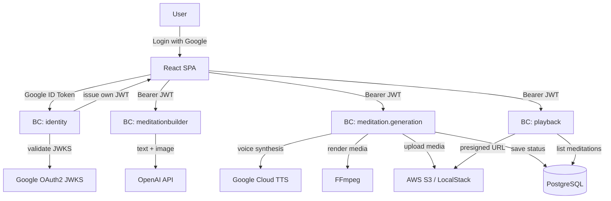
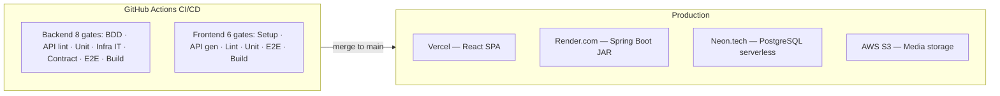
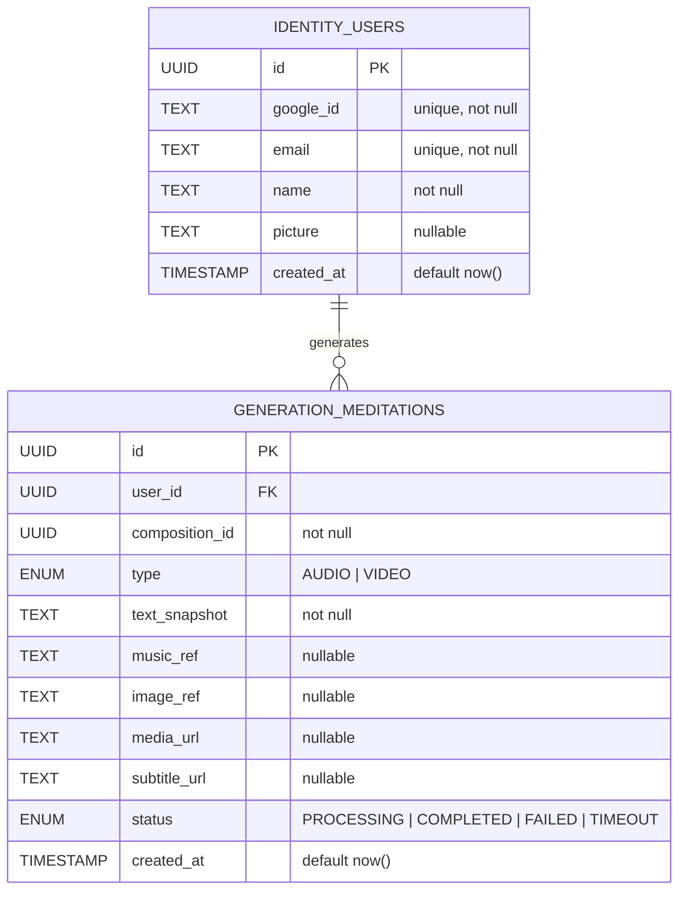

## Index

0. [Project card](#0-project-card)
1. [Product overview](#1-product-overview)
2. [System architecture](#2-system-architecture)
3. [Data model](#3-data-model)
4. [API specification](#4-api-specification)
5. [User stories](#5-user-stories)
6. [Work tickets](#6-work-tickets)
7. [Pull requests](#7-pull-requests)

---

## 0. Project card

### **0.1. Full name:**

Javier Vidal Carbajo

### **0.2. Project name:**

Meditation Builder

### **0.3. Brief description:**

Meditation Builder is a web SPA that lets any authenticated user create personalized meditations end-to-end: write or AI-generate a meditation script, select optional background music and an AI-generated image, and the system automatically produces a narrated MP4 video (1280×720 with synchronized SRT subtitles) or a standalone MP3 podcast. All generated meditations are saved in a personal library for later playback.

### **0.4. Project URL:**

> https://ai-4-devs-finalproject-nine.vercel.app/

### **0.5. Repository URL**

> https://github.com/LIDR-academy/AI4Devs-finalproject/tree/feature-entrega3-JVC

---

## 1. Product overview

### **1.1. Objective**

Meditation Builder solves the problem of creating high-quality, personalized meditation content. Today, users either choose from a fixed catalog (no personalization) or spend hours producing audio/video manually. Meditation Builder reduces that to a few minutes: describe your intention, optionally let AI write the script and generate a background image, and receive a ready-to-play narrated video or podcast.

**Target users:** individuals interested in meditation and mindfulness who want personalized content without production skills.

**Value delivered:**
- Full E2E pipeline — from plain text to professional video/podcast in one screen
- Real-voice narration (Google Cloud TTS, voice `es-ES-Neural2-Diana`) with auto-synchronized SRT subtitles
- One-click AI text and image generation (OpenAI GPT + DALL-E / gpt-image-1)
- Personal library with instant playback from S3 pre-signed URLs

### **1.2. Main features**

| # | Feature | Description |
|---|---------|-------------|
| US1 | **Google OAuth Authentication** | Sign in with Gmail — automatic profile creation, backend-issued JWT, protected routes via `AuthGuard` |
| US2 | **Meditation Composition** | Manual form or AI-assisted composition (title, guided theme, breathing pattern, ambient sound, voice style, duration 5–60 min); DRAFT/PUBLISHED states |
| US3 | **Multimedia Generation** | Synchronous pipeline: Google TTS voice → DALL-E background image → FFmpeg 1280×720 MP4 + MP3 podcast + SRT subtitles → S3 upload |
| US4 | **Library & Playback** | Personal meditation library sorted by date; HTML5 video/audio player with S3 pre-signed URLs (1h TTL) |

### **1.3. Design and user experience**

The application follows a linear, single-page flow:

1. **Login** (`/login`) — Google OAuth button; redirects authenticated users straight to the library.
2. **Library** (`/library`) — card grid of meditations with thumbnail, title, duration and status badge. Empty state with CTA when no meditations exist.
3. **Compose** (`/compose`) — split form: left panel for content fields; right panel for real-time AI generation toggles and preview. A dynamic indicator switches between "podcast" (no image) and "video" (with image).
4. **Player** (`/player/:id`) — HTML5 `<video>` player for MP4 with subtitle track; falls back to `<audio>` for MP3-only meditations.

Screenshots and a video walkthrough are available in the `/docs/` folder.

### **1.4. Installation instructions**

#### Prerequisites

| Tool | Minimum version |
|------|----------------|
| Java (Temurin/Corretto) | 21 |
| Maven | 3.8+ |
| Node.js | 18+ |
| npm | 9+ |
| FFmpeg | 6+ (must be on `PATH`) |
| Docker (optional) | 24+ (for LocalStack) |

#### Required environment variables

Create `backend/src/main/resources/application-local.yml` (copy from `application-local.yml.example`):

```yaml
spring:
  datasource:
    url: jdbc:postgresql://<NEON_HOST>/neondb?sslmode=require
    username: <DB_USER>
    password: <DB_PASSWORD>

security:
  jwt:
    secret: <YOUR_JWT_SECRET_32_CHARS+>

google:
  client-id: <GOOGLE_OAUTH_CLIENT_ID>

openai:
  api-key: <OPENAI_API_KEY>

google-tts:
  credentials-json: <PATH_TO_GOOGLE_APPLICATION_CREDENTIALS_JSON>

aws:
  s3:
    bucket: meditation-builder
    endpoint: http://localhost:4566   # LocalStack; remove for real S3
    region: us-east-1
    access-key: test
    secret-key: test
```

Create `frontend/.env.local`:

```
VITE_API_BASE_URL=http://localhost:8080
VITE_GOOGLE_CLIENT_ID=<GOOGLE_OAUTH_CLIENT_ID>
```

#### Start the backend

```bash
cd backend
mvn clean install -DskipTests
mvn spring-boot:run -Dspring-boot.run.profiles=local
# API available at http://localhost:8080
```

#### Start the frontend

```bash
cd frontend
npm install
npm run generate:api    # generates OpenAPI clients from backend spec
npm run dev
# SPA available at http://localhost:3011
```

#### LocalStack (optional — local S3)

```bash
cd backend
docker-compose up -d localstack
# then run init script:
bash init-localstack.sh
```

#### Run all tests

```bash
# Backend (8 CI gates)
cd backend
mvn verify

# Frontend (unit + integration)
cd frontend
npm run test

# Frontend E2E (Playwright)
npm run test:e2e
```

---

## 2. System architecture

### **2.1. Architecture diagram**

The backend follows **Hexagonal Architecture (Ports & Adapters)** organized into 4 independent Bounded Contexts (DDD). Each BC has its own domain, application (use cases), infrastructure (adapters), and REST controller layer — with zero cross-BC direct dependencies at the domain level.



**Why hexagonal architecture?**
- **Testability:** domain and use cases have no framework dependencies → pure unit tests.
- **Replaceability:** swap PostgreSQL, OpenAI, or S3 by changing only the infrastructure adapter, not the domain.
- **Boundary enforcement:** CI contract tests verify every BC's OpenAPI contract independently.

**Trade-offs:**
- Higher initial scaffolding cost (mitigated by templates and AI pair programming).
- Synchronous generation pipeline blocks the HTTP thread for up to ~187s on long meditations (explicit architectural choice to avoid SQS/worker complexity for the MVP).

### **2.2. Main components**

| Component | Technology | Role |
|-----------|-----------|------|
| **React SPA** | React 18 + TypeScript + Vite, React Query, Zustand, `@react-oauth/google` | User interface; manages auth state, composition form, library, player |
| **BC: identity** | Spring Boot + Java 21 | Google `id_token` validation via JWKS, `PerfilDeUsuario` aggregate, backend JWT issuance |
| **BC: meditationbuilder** | Spring Boot + Java 21 + OpenAI | `Meditation` aggregate, manual/AI composition use cases, GPT text generation |
| **BC: meditation.generation** | Spring Boot + Java 21 + Google TTS + FFmpeg + S3 | Synchronous TTS→image→render→upload pipeline, `GenerationJob` aggregate |
| **BC: playback** | Spring Boot + Java 21 + S3 | Library listing, S3 pre-signed URL generation |
| **PostgreSQL** | Neon.tech (serverless) + Flyway | schemas: `identity` · `generation`; versioned migrations |
| **AWS S3 / LocalStack** | S3 SDK v2 | Media asset storage (`video.mp4`, `audio.mp3`, `subs.srt`) |
| **OpenAI API** | GPT-4o (text), gpt-image-1 (images) | AI content and background image generation |
| **Google Cloud TTS** | `es-ES-Neural2-Diana` | Natural voice narration of meditation scripts |
| **FFmpeg** | v6+ system binary | Renders 1280×720 MP4, podcast MP3, and SRT subtitle sync |

### **2.3. Project structure**

```
AI4Devs-finalproject/
├── backend/                         # Spring Boot Java 21 API
│   └── src/
│       ├── main/java/com/hexagonal/
│       │   ├── identity/            # BC: Google OAuth + JWT
│       │   │   ├── domain/          # PerfilDeUsuario aggregate, ports
│       │   │   ├── application/     # IniciarSesionConGoogleUseCase
│       │   │   ├── infrastructure/  # JWKS adapter, JPA, JWT issuer
│       │   │   └── controllers/     # AuthController REST
│       │   ├── meditationbuilder/   # BC: composition + AI
│       │   ├── meditation/generation/ # BC: TTS + FFmpeg + S3
│       │   ├── playback/            # BC: library + streaming
│       │   └── shared/              # BearerTokenFilter, cross-cutting
│       ├── resources/
│       │   └── openapi/             # OpenAPI YAML per BC
│       └── test/
│           ├── resources/features/  # Cucumber .feature files
│           ├── java/.../bdd/        # BDD step definitions
│           ├── java/.../e2e/        # End-to-end tests
│           └── contracts/           # Contract tests
├── frontend/                        # React + TypeScript SPA
│   └── src/
│       ├── api/generated/           # Auto-generated OpenAPI clients
│       ├── components/              # Shared UI components
│       ├── pages/                   # LoginPage, LibraryPage, ComposePage, PlayerPage
│       ├── state/                   # Zustand stores (authStore, meditationStore)
│       └── hooks/                   # React Query hooks
├── docs/                            # PRD, user stories, tickets
└── specs/                           # BDD specs, plans, task breakdowns
```

Each BC follows the same internal hexagonal structure:
```
<bc>/
  domain/         entities, aggregates, value objects, in/out ports
  application/    use cases (orchestration only, no business logic)
  infrastructure/ JPA adapters, external API clients, S3 adapter
  controllers/    REST controllers strictly matching OpenAPI spec
```

### **2.4. Infrastructure and deployment**



- **Backend:** Dockerized Spring Boot JAR deployed to Render.com; secrets via environment variables.
- **Frontend:** Vite production build deployed to Vercel (automatic on push to `main`).
- **Database:** Neon.tech PostgreSQL serverless; Flyway migrations run on startup.
- **Storage:** AWS S3 us-east-1; LocalStack used in development via Docker Compose.
- **Secrets:** All API keys and credentials injected as environment variables — never hardcoded.

### **2.5. Security**

| Practice | Implementation |
|----------|---------------|
| **Authentication** | Google OAuth2 `id_token` validated against Google's JWKS public endpoint; backend issues its own HS256 JWT (configurable secret, 24h expiry) |
| **Authorization** | `BearerTokenFilter` extracts `userId` from JWT and injects into `SecurityContext`; all protected endpoints require a valid token |
| **Stateless sessions** | No server-side session storage; JWT is the only session mechanism |
| **Ownership enforcement** | Every domain use case validates that the requesting `userId` matches the resource owner — 403 returned otherwise |
| **S3 access** | Pre-signed URLs with 1h TTL — no public buckets; least-privilege IAM policy |
| **Secrets management** | Zero hardcoded secrets; `.env` / `application-local.yml` excluded from version control |
| **TLS** | Mandatory on all production HTTP endpoints (enforced by Render.com + Vercel) |
| **CORS** | Strict allowlist in Spring Security configuration |

### **2.6. Tests**

The project enforces **8 backend CI gates** and **6 frontend CI gates**:

#### Backend

| Gate | Type | Tool | Coverage |
|------|------|------|---------|
| BDD | Acceptance | Cucumber 7 | 18 scenarios across 4 BCs |
| API Verification | Contract lint | Redocly / Spectral | All OpenAPI YAMLs |
| Unit Domain | TDD | JUnit 5 + AssertJ | All aggregates + value objects |
| Unit App | TDD | JUnit 5 + Mockito | All use cases |
| Infra IT | Integration | Testcontainers + WireMock | JPA adapters + external API adapters |
| Contract | Provider | Spring Cloud Contract | All REST controllers vs OpenAPI |
| E2E | End-to-end | REST Assured | 19 full-flow scenarios |
| Build | Package | Maven `verify` | Fat JAR generation |

#### Frontend

| Gate | Type | Tool |
|------|------|------|
| API Generation | Code gen | `openapi-generator` CLI |
| Lint & Type check | Static | ESLint + TypeScript strict |
| Unit & Integration | Component | Vitest + React Testing Library + MSW |
| E2E | Browser | Playwright (Chromium) |
| Build | Bundle | Vite production build |

### **2.7. Observability**

The project implements a full observability strategy using **OpenTelemetry** and **Micrometer**, providing complete visibility into application performance, behavior, and health.

#### Metrics

The application exposes custom metrics in Prometheus format at `/actuator/prometheus`:

**Business metrics:**
- `meditation.composition.created` (Counter) — compositions created, tagged by `output_type`
- `meditation.ai.text.generation.duration` (Timer) — AI text generation latency, tagged by `ai_provider` and `status`
- `meditation.ai.image.generation.duration` (Timer) — AI image generation latency, tagged by `ai_provider` and `status`
- `meditation.ai.generation.failures` (Counter) — AI generation failures, tagged by `ai_provider`, `operation`, `error_code`

**HTTP metrics:**
- `http.client.requests` — automatic outbound HTTP call metrics (via `ObservationRegistry`)

#### Distributed tracing

Traces are sent to an OTLP collector (default: `http://localhost:4318/v1/traces`). All critical business methods are instrumented with `@Observed`:
- `composition.create`, `composition.update-text`, `ai.text.generate`, `ai.image.generate`

**Sampling:**
- Local/Development: 100% (AlwaysOnSampler)
- Production: configurable via `OTEL_SAMPLING_PROBABILITY` (default `1.0`)

#### Structured logging

All logs carry a `compositionId` / `meditationId` in MDC for full transaction traceability. Key events: `composition.created`, `ai.text.generation.requested/completed/failed`, `external.service.call.start/end`.

#### Configuration

```yaml
management:
  endpoints:
    web:
      exposure:
        include: prometheus
  tracing:
    sampling:
      probability: \${OTEL_SAMPLING_PROBABILITY:1.0}
  otlp:
    tracing:
      endpoint: \${OTEL_EXPORTER_OTLP_ENDPOINT:http://localhost:4318/v1/traces}
```

---

## 3. Data model

### **3.1. Entity-Relationship diagram**



**S3 asset keys (not persisted in DB):**
```
generation/{userId}/{meditationId}/video.mp4
generation/{userId}/{meditationId}/audio.mp3
generation/{userId}/{meditationId}/subs.srt
```

### **3.2. Entity descriptions**

#### `identity.users`

| Field | Type | Constraints | Description |
|-------|------|-------------|-------------|
| `id` | UUID | PK, not null | Internal user identifier (auto-generated) |
| `google_id` | Text | Unique, not null | Google subject identifier from the `id_token` |
| `email` | Text | Unique, not null | User's Gmail address |
| `name` | Text | not null | Display name from Google profile |
| `picture` | Text | Nullable | Profile picture URL from Google |
| `created_at` | Timestamp | Default `now()` | First login timestamp |

**Domain aggregate:** `PerfilDeUsuario` (BC: `identity`)  
**Invariants:** `googleIdentifier` is immutable after creation; email uniqueness enforced at DB and domain level.

---

#### `generation.meditations`

| Field | Type | Constraints | Description |
|-------|------|-------------|-------------|
| `id` | UUID | PK, not null | Meditation identifier |
| `user_id` | UUID | FK → `identity.users(id)`, not null | Owner of the meditation |
| `composition_id` | UUID | not null | Reference to the source composition (logical FK) |
| `type` | Enum `AUDIO\|VIDEO` | not null | Output type: VIDEO if image present, AUDIO otherwise |
| `text_snapshot` | Text | not null | Snapshot of the narration script at generation time |
| `music_ref` | Text | Nullable | Reference to the selected music track |
| `image_ref` | Text | Nullable | URL or key of the background image; presence determines type |
| `media_url` | Text | Nullable | S3 URL of `video.mp4` or `audio.mp3` (set on COMPLETED) |
| `subtitle_url` | Text | Nullable | S3 URL of `subs.srt` (set on COMPLETED for VIDEO type) |
| `status` | Enum | not null | `PROCESSING` → `COMPLETED` or `FAILED` or `TIMEOUT` |
| `created_at` | Timestamp | Default `now()` | Generation request timestamp |

**Domain aggregate:** `GenerationJob` (BC: `meditation.generation`)  
**Relationships:** Many meditations per user (1:N). No separate job table — processing is synchronous within the generation request.

---

## 4. API specification

### Endpoint 1 — Authenticate with Google

```yaml
POST /api/v1/identity/auth/google
Summary: Exchange a Google id_token for a backend session JWT

Request body (application/json):
  required: [idToken]
  properties:
    idToken:
      type: string
      description: Google OAuth2 id_token received by the SPA

Responses:
  200:
    description: Authentication successful
    content:
      application/json:
        schema:
          type: object
          properties:
            token:    { type: string, description: "Backend-issued JWT (HS256, 24h)" }
            userId:   { type: string, format: uuid }
            name:     { type: string }
            email:    { type: string, format: email }
            picture:  { type: string, format: uri }
  401:
    description: Invalid or expired Google token
    content:
      application/json:
        schema:
          properties:
            error: { type: string, example: "Invalid Google token" }
```

**Example:**
```bash
curl -X POST http://localhost:8080/api/v1/identity/auth/google \
  -H "Content-Type: application/json" \
  -d '{"idToken": "<google_id_token>"}'
# → {"token":"eyJ...","userId":"a1b2c3...","name":"Jane Doe","email":"jane@gmail.com","picture":"https://..."}
```

---

### Endpoint 2 — Trigger multimedia generation

```yaml
POST /api/v1/generation/meditations
Summary: Synchronously generate voice narration, video/audio, and subtitles for a composed meditation
Security: Bearer JWT required

Request body (application/json):
  required: [compositionId]
  properties:
    compositionId:
      type: string
      format: uuid
      description: ID of the composition to generate media for

Responses:
  201:
    description: Generation complete — media assets ready
    content:
      application/json:
        schema:
          type: object
          properties:
            meditationId: { type: string, format: uuid }
            type:         { type: string, enum: [VIDEO, AUDIO] }
            mediaUrl:     { type: string, format: uri, description: "S3 URL of video.mp4 or audio.mp3" }
            subtitleUrl:  { type: string, format: uri, description: "S3 URL of subs.srt (VIDEO only)" }
            status:       { type: string, enum: [COMPLETED] }
  401:
    description: Missing or invalid JWT
  403:
    description: Composition belongs to a different user
  404:
    description: Composition not found
  500:
    description: Generation pipeline failure (TTS / FFmpeg / S3 error)
```

**Example:**
```bash
curl -X POST http://localhost:8080/api/v1/generation/meditations \
  -H "Authorization: Bearer <jwt>" \
  -H "Content-Type: application/json" \
  -d '{"compositionId": "d3e4f5..."}'
# → {"meditationId":"f1e2d3...","type":"VIDEO","mediaUrl":"https://s3.../video.mp4","subtitleUrl":"https://s3.../subs.srt","status":"COMPLETED"}
```

---

### Endpoint 3 — List meditation library

```yaml
GET /api/v1/playback/library
Summary: Return all meditations belonging to the authenticated user, sorted by creation date (newest first)
Security: Bearer JWT required

Responses:
  200:
    description: Meditation list
    content:
      application/json:
        schema:
          type: array
          items:
            type: object
            properties:
              id:           { type: string, format: uuid }
              title:        { type: string }
              type:         { type: string, enum: [VIDEO, AUDIO] }
              status:       { type: string, enum: [PROCESSING, COMPLETED, FAILED, TIMEOUT] }
              thumbnailUrl: { type: string, format: uri }
              durationSec:  { type: integer }
              createdAt:    { type: string, format: date-time }
  401:
    description: Missing or invalid JWT
```

**Example:**
```bash
curl http://localhost:8080/api/v1/playback/library \
  -H "Authorization: Bearer <jwt>"
# → [{"id":"f1e2...","title":"Morning calm","type":"VIDEO","status":"COMPLETED","durationSec":420,"createdAt":"2025-03-10T08:00:00Z"}]
```

---

## 5. User stories

### User Story 1 — Google OAuth Authentication

| Field | Value |
|-------|-------|
| **Title** | Google OAuth Authentication |
| **User Story** | As a user, I want to sign in with my Google account so that I can access Meditation Builder without managing a separate password. |
| **Business Value** | Frictionless onboarding — eliminates registration barriers and credential management risk. |
| **Priority** | Must Have · 13 SP · Status: Completed |

**Description:** The user visits Meditation Builder and sees a **Sign in with Google** button. After granting permission, the backend validates the Google `id_token` via JWKS and issues its own session JWT. First-time users get an automatic profile; returning users receive a new JWT for the same profile (idempotent). All routes except `/login` require a valid JWT — unauthenticated requests redirect to the login page.

**Acceptance criteria (BDD):**

```gherkin
Scenario: New user logs in for the first time
  Given the user is not authenticated
  When the user clicks "Sign in with Google" and completes the OAuth flow
  Then the system validates the Google id_token via JWKS
  And creates a new PerfilDeUsuario with the email, name, and picture from Google
  And issues a session JWT scoped to the new userId
  And redirects the user to the meditation library (empty)

Scenario: Unauthenticated user accesses a protected route
  Given the user is not authenticated
  When the user navigates directly to "/library"
  Then the system redirects them to "/login"

Scenario: User logs out
  Given the user is authenticated
  When the user clicks Logout
  Then the session JWT is invalidated
  And the user is redirected to "/login"
```

---

### User Story 2 — Multimedia Generation

| Field | Value |
|-------|-------|
| **Title** | Generate Multimedia Meditation |
| **User Story** | As an authenticated user, I want to generate a multimedia meditation (video, audio, subtitles) from my composed content, so that I can experience it as an immersive session. |
| **Business Value** | Flagship differentiator — converts text into a fully produced meditation with real voice, visuals, and subtitles. |
| **Priority** | Must Have · 34 SP · Status: Completed |

**Description:** Once a meditation is composed, the user triggers generation. The system synchronously runs: Google TTS voice narration → DALL-E background image → FFmpeg render (1280×720 MP4 + MP3 + SRT) → S3 upload. The user receives all media URLs in the HTTP response — no polling required.

**Acceptance criteria (BDD):**

```gherkin
Scenario: User generates multimedia for a complete meditation
  Given the user is authenticated and has a composed meditation
  When the user triggers generation for their meditationId
  Then the system returns HTTP 201 with videoUrl, audioUrl, and subtitlesUrl
  And the assets are accessible at those URLs

Scenario: Generation requested for another user's meditation
  Given the user is authenticated
  When the user triggers generation for a meditationId they do not own
  Then the system returns HTTP 403

Scenario: Partial generation failure
  Given a subsystem (TTS, image, or FFmpeg) fails during generation
  Then the system returns HTTP 500 with an error detail message
  And no partial assets are stored
```

---

### User Story 3 — Library & Playback

| Field | Value |
|-------|-------|
| **Title** | List and Play Meditations |
| **User Story** | As an authenticated user, I want to browse my meditation library and play any generated meditation, so that I can revisit and enjoy my personalized sessions. |
| **Business Value** | Closes the core user loop — without playback, generated meditations have no consumption path. |
| **Priority** | Must Have · 13 SP · Status: Completed |

**Description:** The authenticated user opens the Library page and sees their meditations sorted newest first. Each entry shows the title, thumbnail, duration, and status. Clicking a meditation opens the player which streams via S3 pre-signed URLs (1h TTL). An empty state is shown when no meditations exist yet.

**Acceptance criteria (BDD):**

```gherkin
Scenario: User with meditations opens the library
  Given the user is authenticated and has generated meditations
  When the user navigates to the library
  Then the system returns a list of meditations sorted by creation date (newest first)
  And each entry shows title, thumbnail, duration, and streaming URL

Scenario: User with no meditations opens the library
  Given the user is authenticated and has no meditations
  When the user navigates to the library
  Then the UI shows an empty state with a "Create your first meditation" prompt

Scenario: Unauthenticated user accesses the library
  Given the user is not authenticated
  When a GET request is sent to /api/v1/playback/library
  Then the system returns HTTP 401
  And the frontend redirects to "/login"
```

---

## 6. Work tickets

### Ticket 1 — Backend: `PerfilDeUsuario` Domain Aggregate (AUTH-T003)

**Type:** Backend Domain · **BC:** identity · **US:** US1 · **Status:** Completed

**Objective:** Implement the `PerfilDeUsuario` aggregate root in the `identity` domain layer with its invariants, factory methods, and ports — with no Spring or infrastructure imports.

**Artifacts:**
- `backend/src/main/java/com/hexagonal/identity/domain/model/PerfilDeUsuario.java` — Java record
- `backend/src/main/java/com/hexagonal/identity/domain/port/in/AutenticarConGooglePort.java`
- `backend/src/main/java/com/hexagonal/identity/domain/port/out/BuscarPerfilPorGoogleIdPort.java`
- `backend/src/main/java/com/hexagonal/identity/domain/port/out/PersistirPerfilPort.java`

**Technical specification:**

```java
// Domain record — immutable, no Spring annotations
public record PerfilDeUsuario(
    UUID id,
    String googleIdentifier,   // immutable after creation
    String email,
    String name,
    String pictureUrl,
    Instant createdAt          // injected via Clock — never new Date()
) {
    // Factory method — first access
    public static PerfilDeUsuario newUser(String googleId, String email,
                                          String name, String pictureUrl, Clock clock) {
        Objects.requireNonNull(googleId, "googleIdentifier must not be null");
        Objects.requireNonNull(email,    "email must not be null");
        return new PerfilDeUsuario(UUID.randomUUID(), googleId, email, name, pictureUrl,
                                   clock.instant());
    }
}

// Input port
public interface AutenticarConGooglePort {
    TokenDeSesion autenticar(CredencialGoogle credencial);
}

// Output ports
public interface BuscarPerfilPorGoogleIdPort {
    Optional<PerfilDeUsuario> buscarPorGoogleId(String googleId);
}
public interface PersistirPerfilPort {
    PerfilDeUsuario persistir(PerfilDeUsuario perfil);
}
```

**Acceptance criteria:**
- `PerfilDeUsuario` unit tests pass: null `googleIdentifier` throws, immutability verified, `createdAt` uses injected clock
- Zero Spring or infrastructure imports in the domain package
- All input/output ports defined as interfaces with no implementation details

---

### Ticket 2 — Frontend: Auth state + `LoginPage` (AUTH-T009)

**Type:** Frontend · **BC:** identity (SPA) · **US:** US1 · **Status:** Completed

**Objective:** Implement the Zustand `authStore`, the `LoginPage` with Google OAuth button, and the `AuthGuard` component that protects all routes requiring authentication.

**Artifacts:**
- `frontend/src/state/authStore.ts`
- `frontend/src/pages/LoginPage.tsx`
- `frontend/src/components/AuthGuard.tsx`

**Technical specification:**

```typescript
// authStore.ts
interface AuthState {
  token: string | null
  userId: string | null
  name: string | null
  picture: string | null
  setAuth: (payload: AuthPayload) => void
  clearAuth: () => void
}

export const useAuthStore = create<AuthState>()(
  persist(
    (set) => ({
      token: null, userId: null, name: null, picture: null,
      setAuth: (payload) => set(payload),
      clearAuth: () => set({ token: null, userId: null, name: null, picture: null }),
    }),
    { name: 'auth-storage' }
  )
)

// AuthGuard.tsx — redirect to /login if no token
export function AuthGuard({ children }: { children: ReactNode }) {
  const token = useAuthStore(s => s.token)
  if (!token) return <Navigate to="/login" replace />
  return <>{children}</>
}
```

**Acceptance criteria:**
- `LoginPage` renders the Google button when no session is active
- Successful Google OAuth flow stores the JWT and user data in `authStore`
- Navigating to `/library` without a token redirects to `/login`
- `clearAuth()` is called on logout; subsequent navigation to `/library` redirects to `/login`
- Vitest + RTL unit tests cover: renders correctly, redirect on no token, redirect after logout

---

### Ticket 3 — Database: Flyway migration for `generation.meditations` (GEN-T011)

**Type:** Database · **BC:** meditation.generation · **US:** US3 · **Status:** Completed

**Objective:** Create the Flyway migration that sets up the `generation` schema and `generation.meditations` table, including the `status` enum type, foreign key to `identity.users`, and appropriate indexes for the most common query patterns.

**Artifacts:**
- `backend/src/main/resources/db/migration/V4__create_generation_meditations.sql`

**SQL specification:**

```sql
-- V4__create_generation_meditations.sql

CREATE SCHEMA IF NOT EXISTS generation;

CREATE TYPE generation.meditation_type   AS ENUM ('AUDIO', 'VIDEO');
CREATE TYPE generation.meditation_status AS ENUM ('PROCESSING', 'COMPLETED', 'FAILED', 'TIMEOUT');

CREATE TABLE generation.meditations (
    id             UUID                        PRIMARY KEY DEFAULT gen_random_uuid(),
    user_id        UUID                        NOT NULL
                       REFERENCES identity.users(id) ON DELETE CASCADE,
    composition_id UUID                        NOT NULL,
    type           generation.meditation_type  NOT NULL,
    text_snapshot  TEXT                        NOT NULL,
    music_ref      TEXT,
    image_ref      TEXT,
    media_url      TEXT,
    subtitle_url   TEXT,
    status         generation.meditation_status NOT NULL DEFAULT 'PROCESSING',
    created_at     TIMESTAMP WITH TIME ZONE    NOT NULL DEFAULT now()
);

-- Indexes for most common queries
CREATE INDEX idx_gen_meditations_user_id    ON generation.meditations (user_id);
CREATE INDEX idx_gen_meditations_status     ON generation.meditations (status);
CREATE INDEX idx_gen_meditations_created_at ON generation.meditations (created_at DESC);
```

**Acceptance criteria:**
- `mvn flyway:migrate` succeeds with no errors on a clean schema
- `generation.meditations` table exists with all columns and correct types
- Both enum types (`meditation_type`, `meditation_status`) are created in the `generation` schema
- FK constraint to `identity.users(id)` with `ON DELETE CASCADE` verified
- Integration test `GenerationJobJpaAdapterIT` passes against Testcontainers PostgreSQL

---

## 7. Pull requests

### Pull Request 1 — US1: Google OAuth Authentication + Identity BC

**Branch:** `feature/us1-google-oauth-identity`  
**Target:** `feature-entrega3-JVC`  
**Size:** +2,847 / -312 lines across 47 files

**Summary:** Implements the complete Google OAuth authentication flow. Creates the `identity` bounded context from scratch (hexagonal structure), adds the `BearerTokenFilter` shared security component, migrates all existing BC controllers from `X-User-Id` header to `SecurityContext`, and delivers the full frontend auth flow (`LoginPage`, `AuthGuard`, `authStore`).

**Key changes:**
- `identity/domain/model/PerfilDeUsuario.java` — immutable aggregate record
- `identity/infrastructure/in/rest/AuthController.java` — `POST /auth/google` + `POST /auth/logout`
- `shared/security/BearerTokenFilter.java` — cross-cutting JWT extraction
- `frontend/src/state/authStore.ts` + `LoginPage.tsx` + `AuthGuard.tsx`
- Flyway migration `V3__create_identity_users.sql`
- 18 BDD scenarios all green; 4 backend E2E tests passing

**Review checklist:**
- [x] BDD gate passes (`@identity` — 5 scenarios)
- [x] No Spring imports in domain layer
- [x] `X-User-Id` header removed from all 3 existing BCs
- [x] Contract tests against `US1.yaml`
- [x] Playwright E2E: login flow + logout + protected route redirect

---

### Pull Request 2 — US2: Meditation Composition + AI Content Generation

**Branch:** `feature/us2-meditation-composition`  
**Target:** `feature-entrega3-JVC`  
**Size:** +3,102 / -45 lines across 38 files

**Summary:** Implements the `meditationbuilder` bounded context — `Meditation` aggregate with its value objects (`BreathingPattern`, `AmbientSoundType`, `VoiceStyle`), manual and AI-assisted composition use cases, OpenAI GPT adapter with fallback text, JPA persistence adapter, REST controller, and the React `ComposePage` with form + AI toggle.

**Key changes:**
- `meditationbuilder/domain/model/Meditation.java` — aggregate with `createManual()` / `createFromAi()` factories
- `meditationbuilder/infrastructure/out/OpenAiContentAdapter.java` — GPT chat completions with WireMock-tested fallback
- `meditationbuilder/infrastructure/in/rest/MeditationCompositionController.java`
- `frontend/src/pages/ComposePage.tsx` + `meditationStore.ts`
- Flyway migration `V5__create_meditationbuilder_meditations.sql`

**Review checklist:**
- [x] BDD gate: 8 scenarios green (`@meditationbuilder`)
- [x] OpenAI fallback tested with WireMock 500 response
- [x] Duration validation (5–60 min) enforced at domain level
- [x] No OpenAI calls in unit tests

---

### Pull Request 3 — US3: Synchronous Multimedia Generation Pipeline

**Branch:** `feature/us3-multimedia-generation`  
**Target:** `feature-entrega3-JVC`  
**Size:** +4,218 / -88 lines across 52 files

**Summary:** Implements the full synchronous multimedia generation pipeline in the `meditation.generation` BC. Integrates Google Cloud TTS, OpenAI image generation, FFmpeg render (1280×720 MP4 + MP3 + SRT), and S3 upload. Adds `GenerationController` with proper ownership checks and the React `GeneratePage` + `VideoPlayer` component.

**Key changes:**
- `generation/application/GenerateMeditationUseCase.java` — 5-step synchronous pipeline
- `generation/infrastructure/out/GoogleCloudTtsAdapter.java` — TTS with WireMock tests
- `generation/infrastructure/out/FfmpegRenderAdapter.java` — video + subtitle rendering
- `generation/infrastructure/out/S3StorageAdapter.java` — LocalStack-tested upload
- Flyway migration `V4__create_generation_meditations.sql`
- 5 BDD scenarios green; 3 backend E2E tests passing

**Review checklist:**
- [x] BDD gate: 5 scenarios green (`@generation`)
- [x] Google TTS and OpenAI interactions tested only via WireMock (no real API calls in tests)
- [x] Ownership enforced: 403 returned for cross-user generation attempts
- [x] S3 upload tested with Testcontainers LocalStack
- [x] FFmpeg binary availability checked at startup with clear error message
